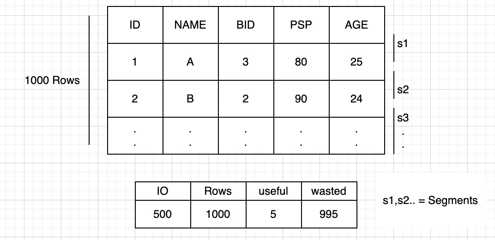
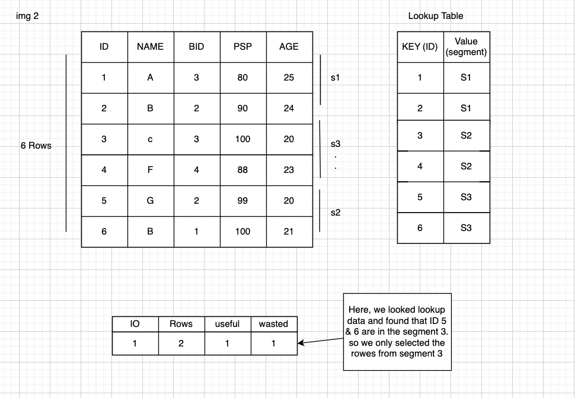
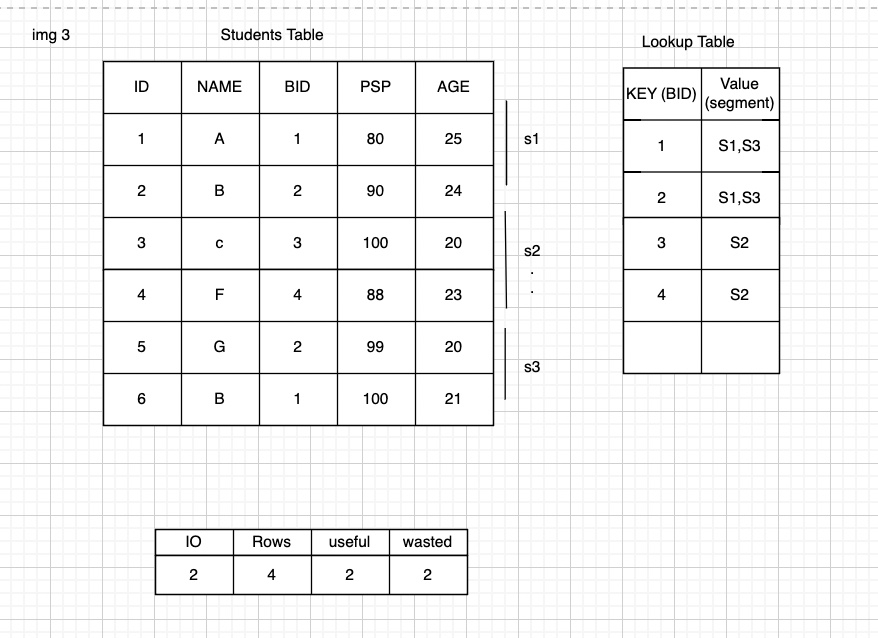
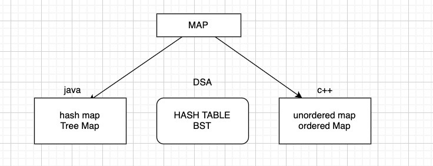

## Indexes

```
select * from students where bid = 2
```

How sql works for above query ?

- Memory:
    - CPU: 3Ghz 3*10 pow 9 ops/sec
    - register >> cache >> RAM >> Hard disk

1. IO Operation brings the data from hard disk to RAM. (segment by segment) (analytics cannot be done in hard disk)
2. once data is in RAM, It is analysed by CPU and rows are selected/ rejected tp prepare results.


- `Fact`: data of table is sorted by primary key on the hard disk.

### Approach 1: Using Slect

- We will have to get all the segments.
- bring all the rows from had disk to RAM
- then, do analysis 
    

### Approach 2: Using Primary key
- Primary Key
- whenever, we keep reading the rows in segments , as soon as we find the segment we have the rows, we stop reading the segment. the subsequent rows will always have the higher value in this case. 

#### SUMMARY:
- WHERE Clause on pimary key will always work faster As, data is sorted by PK & PK is unique also.
- we will stop the future segments when we will find desired row.


### Approach 3: Lookup Table/ Index:
- for every table, mysql creats a lookup table as index [started in RAM as well as hard disk] for the PK.

Query:
```
select * from students where id = 5
```

Now same query will be executed as below:
1. Check lookup table for segment
2. Read segment
3. Process

`Question`: How fast will the segment be in the look up table ?
### DSA Used to implement index: BTree

### Q. How to create INDEXES/ Lookup table ?
- we have seen Look up table for PK, what about the other columns? eg. `bid`

```
select * from student where bid = 2
```
- As we can see, still we could reduce the number of rows to be read.
    

### Demo:
- [Indexes Command](../sql_scripts/8_indexs.sql)

### DSA for index

- Time complexity
    - Hash Table: Average constant
    - BST: O(Log N)

    

### Pros & cons
- Pros:
    - Fast search : optimised read
- Cons:
    - extra space
    - insert, delete (if 1 row deleted, it is ebing delted in lookup table as well)
    - update might take some time

### Guidelines
1. Dont create index without creating tables (let the PK index get created).
2. Anlysis the traffic on DB (tool : `sql profiler`)
3. Create index for columns , which are frequently used by where clause [as per data logged by SQL Profilers]

### Index on string
- similar to the above one, but here lookup table we can use [Initial letter, segment] as key value pair.

### Composite Indexes